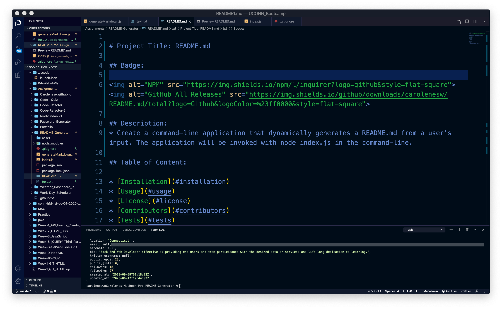
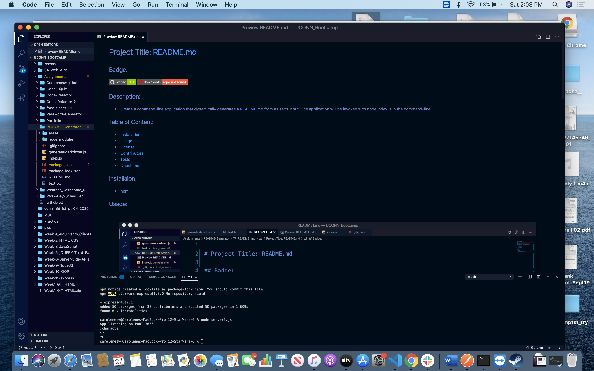

# Project Title: README.md

## Badge: 

 

## Description: 
* Create a command-line application that dynamically generates a README.md from a user's input. The application will be invoked with node index.js in the command-line
## Table of Content: 

* [Installation](#installation)  
* [Usage](#usage)
* [License](#license)
* [Contributors](#contributors)
* [Tests](#tests)
* [Questions](#questions)

## Installaion:
* npm i
## Usage: 

## License: 
* MIT
# Contributing: 
* Pull request and stars are always welcome.
## Testing: 
* N/A
## Questions
If you have any questions, please contact the GitHub user.   
Email: carolenesw@gmail.com

  

https://github.com/Carolenesw/README-Generator_v1

### Original README-Generator (with commits)
https://github.com/Carolenesw/README-Generator
